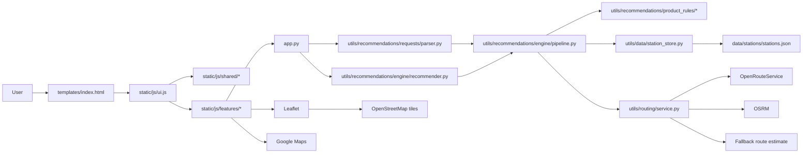
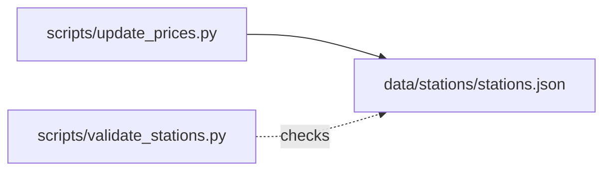

# OPTI-GAS

OPTI-GAS is a mobile-first Flask + Leaflet web app for Tagum City drivers. It opens directly to a full-screen map, highlights the best-value fuel station, and hands off turn-by-turn navigation to Google Maps.

## Stack

- Backend: Flask
- Frontend: HTML, CSS, vanilla JavaScript, Leaflet.js 
- Data: `data/stations/stations.json`
- Routing: OpenRouteService, OSRM, and local fallback route estimation


## Project Layout

- `app.py`: Flask entrypoint and API routes
- `utils/data/`: station loading, caching, validation models, and persistence
- `utils/geo/`: coordinate distance helpers
- `utils/routing/`: live route provider selection, route cache, and fallback route estimation
- `utils/recommendations/`: query parsing, recommendation filters/scoring, engine orchestration, and product rules
- `templates/index.html`: single-page shell
- `static/css/main.css`: stylesheet entrypoint for modular map, overlay, layout, and component styles
- `static/js/ui.js`: thin browser entrypoint and app wiring
- `static/js/features/`: feature modules for Garage, stations, filters, advisories, sheets, and directions
- `static/js/shared/`: shared state, persistence, and formatting helpers
- `scripts/validate_stations.py`: station data validation
- `scripts/update_prices.py`: CLI updater for station prices
- `tests/`: backend unit and integration tests

## Build And Data Flow

This section is split into two diagrams:

1. how the app runs when a user opens Opti-Gas
2. how station data is validated and updated outside the live request path

### 1. App Runtime Flow



How to read it:

1. Flask serves the page shell and API routes.
2. `static/js/ui.js` boots the browser app and composes shared and feature modules.
3. Feature modules render the map, filters, Garage, and Google Maps handoff in the browser.
4. The backend normalizes requests, reads station data, computes routes, and ranks recommendations.
5. Leaflet handles map rendering and OpenStreetMap tiles, while Google Maps handles navigation.

### 2. Station Data Maintenance



How to read it:

1. `scripts/update_prices.py` writes approved station price changes back to `data/stations/stations.json`.
2. `scripts/validate_stations.py` checks station data before it is treated as valid.
3. The maintenance flow is separate from the live app request path.

## Frontend Module Map

The frontend is intentionally split by feature boundary:

- `static/js/ui.js`: thin entrypoint that boots the app, wires events, and composes modules
- `static/js/features/stations.js`: station card rendering, active station selection, and station actions
- `static/js/features/station-search.js`: station lookup, Fuse.js search ranking, display-station shaping, and cached-station rebinding
- `static/js/features/station-summary.js`: summary badge and metadata text for the selected or recommended station
- `static/js/features/price-updates.js`: station price update modal state, API mutation, and refreshed station collection handling
- `static/js/features/garage.js`: Garage rendering, vehicle CRUD, and vehicle form handling
- `static/js/features/garage-policy.js`: active vehicle lookup, trip-input derivation, and recommendation-mode lock policy
- `static/js/features/filters.js`: filter UI syncing, fuel-type button rendering, and location-failure copy
- `static/js/features/location.js`: GPS watch lifecycle, location-failure handling, and refresh-distance policy
- `static/js/features/recommendations.js`: browser recommendation refresh, request assembly, and cached result updates
- `static/js/features/advisories.js`: advisory sheet state, announcements, and drag/close behavior
- `static/js/features/sheets.js`: generic sheet and modal open/close plus bottom-sheet drag behavior
- `static/js/features/directions.js`: Google Maps handoff
- `static/js/features/view.js`: Map-vs-Garage view state and setup-prompt rendering
- `static/js/shared/state.js`: centralized mutable state, DOM element registry, and shared constants
- `static/js/shared/persistence.js`: local/session storage hydration and persistence
- `static/js/shared/formatters.js`: string, date, distance, duration, and mode helpers

## Validation

```bash
python scripts/validate_stations.py
pytest
```

## Algorithms Used

This project is not only a Flask + Leaflet application. Its core behavior is driven by filtering, live routing or fallback route estimation, and ranking algorithms that determine which fuel station should be recommended to the user.

For the current Opti-Route redesign specification, see `docs/opti-route-formula-spec.md`.

For a categorized table of all project algorithms, see `docs/ALGORITHMS.md`.

For the backend folder that contains the executable recommendation formulas and product rules, see `docs/PRODUCT_RULES.md`.

For the current Map + Garage product interaction, saved-vehicle behavior, and first-run gating rules, see `docs/map-garage-product-spec.md`.

For repo-local UI design engineering guidance used for this mobile map experience, see `skills/opti-gas-ui-design-engineering/SKILL.md`.

For team contribution assignments, folder ownership, and review criteria, see `docs/CONTRIBUTION_TASKS.md`.

For when to run each maintenance script, see `docs/SCRIPT_WORKFLOWS.md`.

For demo security measures, threat-model decisions, and security QA checks, see `docs/SECURITY_MEASURES.md`.

For the latest local breach and attack simulation report, see `docs/SECURITY_ATTACK_SIMULATION_REPORT.md`.

For the third-party library inventory and repo locations, see `docs/THIRD_PARTY_LIBRARIES.md`.

## Implementation Details

### 1. Candidate Filtering

The system first reduces the full station dataset into a smaller candidate set.

Filtering steps:

1. Filter by selected brand
2. Filter by selected fuel type availability
3. Filter by radius from the user's origin

Relevant files:

- `utils/recommendations/filters/brand_filter.py`
- `utils/recommendations/filters/fuel_filter.py`
- `utils/recommendations/filters/radius_filter.py`
- `utils/recommendations/engine/pipeline.py`

Pseudocode:

```text
candidate_stations = all_stations
candidate_stations = filter_by_brand(candidate_stations, selected_brand)
candidate_stations = keep_only_stations_with_requested_fuel(candidate_stations, fuel_type)
candidate_stations = filter_by_radius(candidate_stations, user_location, radius_km)
```

Time complexity:

- Brand filtering: `O(n)`
- Radius filtering: `O(n)`
- Fuel-type availability check: `O(n * f)`, where `f` is the number of fuel records per station
- Overall filtering phase: `O(n)` in practice, since `f` is a small constant

### 2. Route Distance and Travel Time Computation

For each remaining candidate station, the system computes route distance and travel time using live routing first and local fallback estimation when needed:

1. OpenRouteService (ORS)
2. OSRM public road routing
3. Local Haversine-based fallback estimate

Relevant files:

- `utils/routing/service.py`
- `utils/routing/providers.py`
- `utils/routing/cache.py`
- `utils/geo/distance.py`

This design is a live-routing provider chain:

- use the most accurate road-network result first
- try OSRM if ORS is unavailable
- use a local fallback estimate if no live route can be resolved or `ROUTING_MODE=estimate` is enabled

Pseudocode:

```text
for each station in candidate_stations:
    if ORS is available:
        route = get_ors_route(origin, station)
    else if OSRM is available:
        route = get_osrm_route(origin, station)
    else:
        route = get_estimated_route(origin, station)
```

Time complexity:

- Local computation per station: `O(1)`
- Full route-evaluation loop: `O(k)` for `k` candidate stations
- External API latency dominates real runtime, but the local algorithmic pass is linear

### 3. Recommendation / Ranking Algorithm

After computing route and fuel data for every candidate station, the system ranks stations using preset-based weighted scoring:

- `opti-route`
- `save-money`
- `save-time`
- `balanced`

The current formula uses:

```text
economic_cost = travel_fuel_cost + purchase_cost
travel_fuel_cost = (distance_km / km_per_liter) * reference_price
purchase_cost = liters_to_buy * station_price

final_score =
    w_cost * norm_cost +
    w_time * norm_time +
    w_distance * norm_distance
```

Trip assumptions are now sourced from the active saved vehicle in `Garage` plus the current Map tank-status override, rather than from always-visible manual sliders.

Ranking uses raw route distance internally. Station cards display `distance_km`
to two decimal places, such as `1.02km`, but rounded display distance never
decides the winning station.

Relevant file:

- `utils/recommendations/product_rules/presets.py`
- `utils/recommendations/product_rules/cost.py`
- `utils/recommendations/product_rules/normalization.py`
- `utils/recommendations/filters/scoring_filter.py`
- `utils/recommendations/product_rules/explanations.py`
- `utils/recommendations/engine/pipeline.py`

Pseudocode:

```text
for each station in candidate_stations:
    compute distance
    compute duration
    compute trip_cost

sort candidate_stations based on selected_mode
best_station = candidate_stations[0]
```

Time complexity:

- Candidate evaluation: `O(k)`
- Sorting: `O(k log k)`
- Final recommendation phase: `O(k log k)`

### 4. Duplicate-Name Resolution Strategy

Some stations may share the same name but represent different physical locations. To avoid collisions in the UI and update flow, the system uses a coordinate-based `station_id`.

Relevant files:

- `utils/data/station_store.py`
- `utils/recommendations/engine/recommender.py`
- `static/js/features/station-search.js`
- `static/js/features/price-updates.js`

This is an identity-resolution algorithm based on location rather than name alone.

### Summary of Core Complexities

- Load + validate stations: `O(n)`
- Brand/radius/fuel filtering: `O(n)`
- Candidate route evaluation: `O(k)`
- Recommendation sorting: `O(k log k)`
- Overall recommendation pipeline: `O(n + k log k)`

Where:

- `n` = total number of stations
- `k` = number of stations remaining after filtering

## Seed From OSM

To pull Tagum fuel-station candidates from OpenStreetMap into a review file:

```bash
python scripts/seed_stations_from_osm.py
```

This writes `data/stations/stations.osm.seed.json` with:

- Tagum candidate stations from OSM
- one station record per location
- required fuels prefilled as `Unleaded 91`, `Premium 95`, and `Diesel`
- placeholder prices for manual cleanup

Review that file carefully before copying entries into `data/stations/stations.json`.

To rank suspicious seed entries for cleanup:

```bash
python scripts/audit_osm_seed.py
```

This writes `data/stations/stations.osm.audit.csv`, which flags:

- generated unnamed stations
- generic `Independent` brands
- likely duplicates by name
- nearby same-name or same-brand candidates
- placeholder prices

## Station Data Shape

Each station now stores one location with multiple fuel records in `data/stations/stations.json`. Every station must define exactly these three fuel types:

- `Unleaded 91`
- `Premium 95`
- `Diesel`

```json
{
  "name": "Petron Apokon",
  "brand": "Petron",
  "lat": 7.4523,
  "lng": 125.8142,
  "fuels": [
    {
      "fuel_type": "Unleaded 91",
      "price": 90.2,
      "last_updated": "2026-04-28"
    },
    {
      "fuel_type": "Diesel",
      "price": 88.4,
      "last_updated": "2026-04-28"
    },
    {
      "fuel_type": "Premium 95",
      "price": 94.6,
      "last_updated": "2026-04-28"
    }
  ]
}
```

## Credits And Attributions

Current attributions:

- OpenStreetMap: map data source; © OpenStreetMap contributors
- OpenRouteService: road-routing and travel-time provider
- Google Maps: external navigation handoff target for `Get Directions`

If map providers, routing providers, seeded data sources, or major framework dependencies change, this section and the in-app credits should be updated in the same task.
